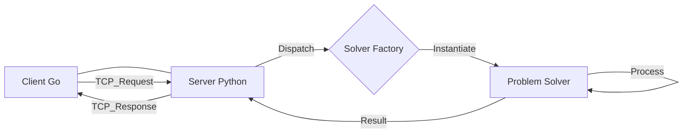

# Distributed Problem Solver

A client-server distributed system designed to process computational problems using a modular solver architecture. This project demonstrates the implementation of distributed computing concepts using **Go** for the client and **Python** for the server, communicating via TCP sockets.

## 🏗️ Architecture

The system follows a synchronous request-response model where the Go client submits problems and the Python server processes them using specific solvers.



## 🧩 Implemented Solvers

The server currently supports the following problem solvers:

- **Fibonacci Verification**: Determines if a given number belongs to the Fibonacci sequence.
- **Prime Number Classification**: Checks if a number is prime.
- **FizzBuzz Solver**: Generates the FizzBuzz result for a specific number.

## 📚 Concepts Applied

- **Distributed Systems**: Separation of concerns between request generation and processing.
- **Client-Server Architecture**: Robust communication model.
- **Socket Communication**: Low-level TCP data exchange.
- **Factory Method Design Pattern**: Used on the server to dynamically instantiate the correct solver based on the client's request.

## 🛠️ Technologies

- **Client**: Go (Golang)
- **Server**: Python 3.x
- **Communication**: TCP Sockets

## ⚡ How to Run

### Prerequisites

- Go 1.18+
- Python 3.8+

### 1. Start the Server

Navigate to the server directory (e.g., `Project APT/server` or root) and run:

```bash
python server.py
```

### 2. Run the Client

Open a new terminal, navigate to the client directory, and run:

```bash
go run client.go
```

## 🔌 Extensibility

To add a new solver, simply create a new Python class implementing the solver interface and register it in the **Solver Factory**. No changes to the core server logic are required.
